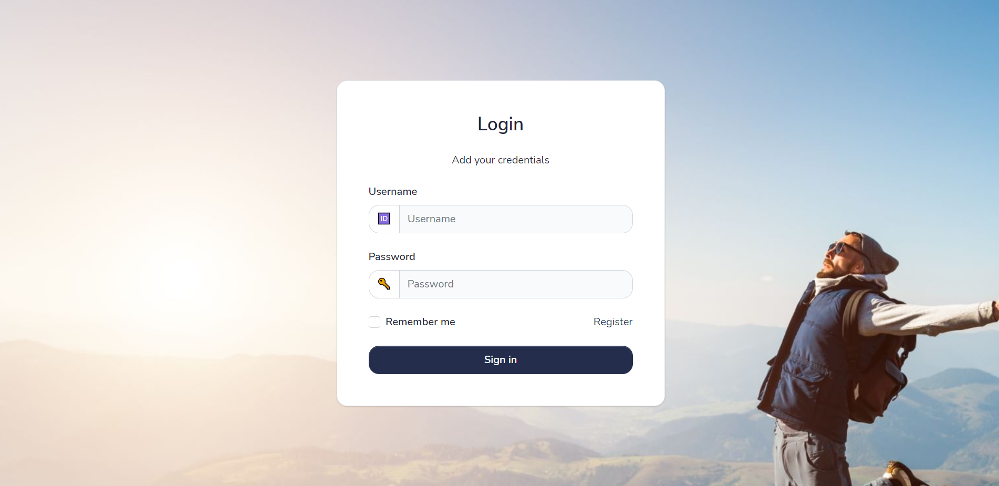
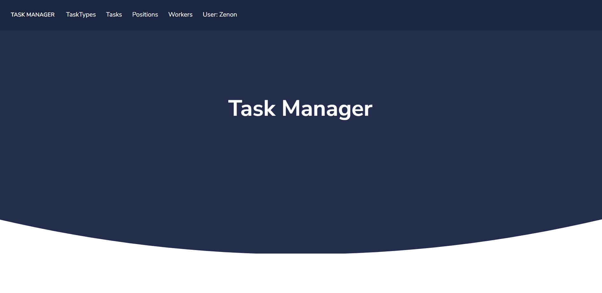
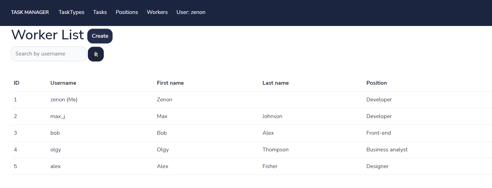

# Task-manager

### Django project for manage IT-team, tasks

## Developed pages:

### Pages of sing in and up


### Home page


### Some examples of others page



## You can check it by yourself [on render](https://task-manager-619q.onrender.com) `(can be slow)`

### Test credentials: 

* User - Test
* Password - TesT123#

### Code-base structure

```
<PROJECT ROOT>
   |
   |-- core/                          # Project configuration
   |
   |-- apps/                          # Apps & files directory
   |    |
   |    |-- authentication/           # Login and registration
   |    |
   |    |-- manager/                  # Main app
   |    |
   |    |-- static/                   # Images, CSS files, Javascripts files
   |    |
   |    |-- templates/                # Templates used to render pages
   |
   |-- requirements.txt               # Modules are required for the project
   |-- .env                           # Environment variables
   |-- manage.py                      # Django default start script
   |
   |-- ************************************************************************
```


### Before starting project, you need to execute the following commands

* #### Don't forget to set up your environment variables or create .env (example in .env.sample)

```bash
python -m venv venv
venv\Scripts\activate (on Windows)
source venv/bin/activate (on macOS)
pip install -r requirements.txt
python manage.py migrate      
python manage.py runserver
```

### Structure of DataBase

